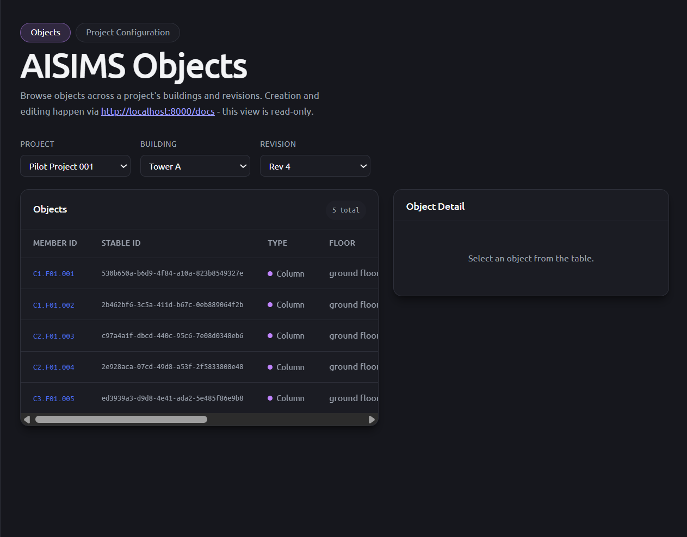

# AISIMS Data Model



Training proposal for the AISIMS data model, focused on **identity design** and **revision design**. It is built as a working prototype (FastAPI + PostgreSQL + React) so the model can be exercised with real requests instead of only drawn on paper.

> **Status: Training Proposal.** This is a learning exercise built from the Week 3 assignment. It is not an approved AICONS production rule. Anything marked "assumption for training only" in the written logs is a temporary rule, not the real AISIMS design.

---

## What this prototype does

- **Accepts input as a JSON body** through the FastAPI interactive docs (`/docs`). There is no upload form or CSV parser. See the [Input Guide](#input-guide) below.
- **Runs the revision workflow** on every submission: stable ID assignment, change status determination, and active status sync, preceded by a pre-validation gate that rejects the whole batch if any reference or required field is invalid.
- **Stores revisions as full snapshots.** A new revision never overwrites the previous one, so earlier states stay traceable.
- **Displays the data in the frontend (read-only):**
  - Project Configuration (Project, Building, Floor, Zone, Grid, Material, Section, BarSpec)
  - Object tables per revision, with each object's **change status** (`added`, `modified`, `unchanged`, `deleted`, `restored`)
  - Object detail with geometry, reinforcement, and quantity

Creating and editing data stays `/docs`-driven on purpose. The frontend is for browsing only.

---

## Architecture

```text
React + TypeScript -> FastAPI -> SQLAlchemy -> PostgreSQL
```

- The frontend (read-only) requests Project Configuration and Object data through the FastAPI endpoints.
- All write access — creating Project Configuration entities, Bulk Upload, Interactive Edit — goes through the same FastAPI endpoints via `/docs`; there is no separate write path.
- Pydantic v2 schemas define request/response validation and shape the OpenAPI spec that the frontend's TypeScript types are generated from.
- SQLAlchemy 2.0 (typed `Mapped` columns) maps Python models to PostgreSQL tables. Every system-generated ID except `stable_id` is drawn from a dedicated Postgres `SEQUENCE` and formatted as a prefixed ID (e.g. `PRJ-001`, `OBJ-014`) by `ids.next_id()`.
- `revision_service.py` implements the revision workflow (Pre-Validation Gate, Stable ID Assignment, Change Status Determination, Active Status Sync, and Interactive Edit's explicit-deletion/carry-forward steps) independently of the HTTP layer in `main.py`.
- Alembic manages every schema change as a migration under `migrations/versions/`.

## Tech Stack

**Backend**
- Python 3.11, FastAPI, Pydantic v2
- SQLAlchemy 2.0 (typed ORM) + Alembic migrations
- PostgreSQL 16 (via Docker Compose), psycopg 3 driver
- pytest (unit + integration tiers), ruff, mypy

**Frontend**
- React 19 + TypeScript + Vite
- Types generated from the live OpenAPI spec via `openapi-typescript`
- ESLint (`eslint-plugin-react-hooks`, `typescript-eslint`)

**CI**
- GitHub Actions ([.github/workflows/ci.yml](.github/workflows/ci.yml)): a backend job (ruff, mypy, migrations, unit + integration tests, `pip-audit`) and a frontend job (lint, build, `npm audit`), on every push and pull request against `main`.

## Project Structure

```text
.
├── main.py                    # FastAPI app: all HTTP endpoints
├── models.py                  # SQLAlchemy models (Project, Building, Floor, Zone, Grid,
│                               #   Material, Section, BarSpec, Identity, Object,
│                               #   Reinforcement, Quantity, Revision)
├── schemas.py                 # Pydantic request/response schemas
├── revision_service.py        # Revision workflow: pre-validation gate, stable ID
│                               #   assignment, change status determination, active
│                               #   status sync / interactive edit
├── ids.py                     # Sequential prefixed-ID generator (PRJ-001, BLD-001, ...)
├── database.py                # Engine/session setup
├── seed.py                    # Seeds Project Configuration tables only
├── migrations/                # Alembic migrations
├── tests/
│   ├── unit/                  # Mocked-session tests
│   └── integration/           # Real-Postgres tests (SAVEPOINT-isolated)
├── frontend/
│   └── src/
│       ├── api.ts             # Shared fetchJson/API_BASE_URL helper
│       ├── pages/
│       │   ├── ObjectsPage.tsx        # Project -> Building -> Revision -> Object browsing
│       │   └── ProjectConfigPage.tsx  # Entity-dropdown-driven Project Configuration table
│       └── types/api-generated.ts     # Generated from /openapi.json
└── docs/                      # Screenshot, working log, and written deliverables
```

## Setup

### Prerequisites

- Python 3.11
- Node.js and npm
- Docker Desktop with Docker Compose
- Git

### 1. Clone the repository

```powershell
git clone https://github.com/daffajauhari/week-3-codex-github.git
cd week-3-codex-github
```

### 2. Configure environment variables

Copy `.env.example` to `.env` in both the project root and the `frontend` directory:

```powershell
Copy-Item .env.example .env
Copy-Item frontend\.env.example frontend\.env
```

Complete the values in the root `.env`:

```env
POSTGRES_PASSWORD=<change>
POSTGRES_HOST=127.0.0.1
POSTGRES_PORT=5432
POSTGRES_USER=your_database_user
POSTGRES_DB=your_database_name
FRONTEND_ORIGIN=http://localhost:5173
VITE_API_BASE_URL=http://localhost:8000
```

`frontend/.env` only needs `VITE_API_BASE_URL`, which should match the backend URL above.

### 3. Set up Python

```powershell
py -3.11.9 -m venv .venv
.\.venv\Scripts\Activate.ps1
python -m pip install -r requirements.txt
```

### 4. Start and prepare the database

```powershell
docker compose up -d
python -m alembic upgrade head
python seed.py
```

### 5. Start the backend

```powershell
python -m fastapi dev main.py
```

### 6. Generate the TypeScript API types

Open another terminal:

```powershell
cd frontend
npm install
npx openapi-typescript http://localhost:8000/openapi.json -o src/types/api-generated.ts
```

The backend must be running while the types are generated.

### 7. Start the frontend

From the `frontend` directory:

```powershell
npm run dev
```

Frontend: `http://localhost:5173`
Interactive API docs (create/edit data here): `http://localhost:8000/docs`

### 8. Run the checks (optional)

From the project root:

```powershell
python -m pytest -m unit
python -m pytest -m integration
python -m ruff check .
python -m mypy .
```

Integration tests exercise a real Postgres database, so the container from step 4 must be running first.

From the `frontend` directory:

```powershell
npm run lint
npm run build
npm audit
```

---

## Input Guide

There are two ways to submit design data. Both create a **new revision** for the building given in the URL path. Both are used from `/docs` by pasting a JSON body into the request box.

Before any object data can be submitted, the Project Configuration (Project, Building, Floor, Zone, Material, Section, BarSpec) must already exist. Each has its own `POST` endpoint. Objects refer to configuration by **name or label** (for example `floor_name`, `sect_label`), never by raw database ID. The server resolves them during the pre-validation gate.

Example values below use millimetres for lengths and coordinates.

### 1. Bulk Upload

**Use when:** you have the complete list of objects for the building (for example, a full export from a design tool).

**How it behaves:** the submission is treated as the full state of the building. The server compares it against the previous revision. An object that exists in the previous revision but is missing from this upload is marked `deleted`. Nothing is inferred from what you "touched", only from what is present.

**Endpoint:** `POST /projects/{project_id}/buildings/{building_id}/revisions/bulk`

**Example: first revision (everything is new)**

```json
{
  "objects": [
    {
      "is_new": true,
      "obj_mark": "C1.02.001",
      "obj_type": "column",
      "floor_name": "Level 2",
      "zone_label": "Z01",
      "sect_label": "C1-400x400",
      "mat_name": "C30",
      "geometry_points": [[0, 0, 4000], [0, 0, 8000]],
      "reinforcements": [
        {
          "barspec_label": "D16",
          "bar_role": "longitudinal",
          "bar_count": 8,
          "bar_len": 4000
        },
        {
          "barspec_label": "D10",
          "bar_role": "transverse",
          "bar_count": 20,
          "bar_len": 1500,
          "bar_space": 200,
          "bar_hook_type": "135deg"
        }
      ]
    },
    {
      "is_new": true,
      "obj_mark": "B1.02.001",
      "obj_type": "beam",
      "floor_name": "Level 2",
      "zone_label": "Z01",
      "sect_label": "B1-300x500",
      "mat_name": "C30",
      "geometry_points": [[0, 0, 8000], [6000, 0, 8000]],
      "reinforcements": [
        {
          "barspec_label": "D19",
          "bar_role": "longitudinal",
          "bar_count": 6,
          "bar_len": 6000
        },
        {
          "barspec_label": "D10",
          "bar_role": "transverse",
          "bar_count": 30,
          "bar_len": 1400,
          "bar_space": 200,
          "bar_hook_type": "135deg"
        }
      ]
    }
  ]
}
```

**Example: second revision (beam section changed, column not uploaded)**

Existing objects are matched to their identity by `stable_id` (or by `ifc_global_id` when the source provides one). The beam gets a new section, so it becomes `modified`. The column is absent, so it becomes `deleted`.

```json
{
  "objects": [
    {
      "is_new": false,
      "stable_id": "<stable_id of the beam from revision 0>",
      "obj_mark": "B1.02.001",
      "obj_type": "beam",
      "floor_name": "Level 2",
      "zone_label": "Z01",
      "sect_label": "B2-300x600",
      "mat_name": "C30",
      "geometry_points": [[0, 0, 8000], [6000, 0, 8000]],
      "reinforcements": [
        {
          "barspec_label": "D19",
          "bar_role": "longitudinal",
          "bar_count": 6,
          "bar_len": 6000
        },
        {
          "barspec_label": "D10",
          "bar_role": "transverse",
          "bar_count": 30,
          "bar_len": 1600,
          "bar_space": 200,
          "bar_hook_type": "135deg"
        }
      ]
    }
  ]
}
```

To **restore** a deleted object in a later bulk upload, include it again with its original `stable_id`. It is recorded as `restored`.

### 2. Interactive Edit

**Use when:** you only want to change a few objects and carry everything else forward.

**How it behaves:** only the objects you list are touched. Every other object is copied into the new revision as `unchanged`. Absence from the request means "leave it alone", the opposite of Bulk Upload. One request can add, change, and delete.

**Endpoint:** `POST /projects/{project_id}/buildings/{building_id}/revisions/edit`

| Field | Purpose |
| --- | --- |
| `changed_objects` | Objects to add or modify. `is_new: true` creates a new logical object, `is_new: false` with a `stable_id` modifies an existing one. |
| `deleted_stable_ids` | `stable_id` values of objects to delete. |

**Example: modify one beam, add one wall, delete one column**

```json
{
  "changed_objects": [
    {
      "is_new": false,
      "stable_id": "<stable_id of the beam>",
      "obj_mark": "B1.02.001",
      "obj_type": "beam",
      "floor_name": "Level 2",
      "zone_label": "Z01",
      "sect_label": "B2-300x600",
      "mat_name": "C30",
      "geometry_points": [[0, 0, 8000], [6000, 0, 8000]],
      "reinforcements": [
        {
          "barspec_label": "D19",
          "bar_role": "longitudinal",
          "bar_count": 6,
          "bar_len": 6000
        }
      ]
    },
    {
      "is_new": true,
      "obj_mark": "W1.02.001",
      "obj_type": "wall",
      "floor_name": "Level 2",
      "zone_label": "Z01",
      "sect_label": "W1-200",
      "mat_name": "C30",
      "geometry_points": [[0, 0, 8000], [6000, 0, 8000], [6000, 0, 12000], [0, 0, 12000]],
      "reinforcements": [
        {
          "barspec_label": "D13",
          "bar_role": "longitudinal",
          "bar_count": 24,
          "bar_len": 4000
        }
      ]
    }
  ],
  "deleted_stable_ids": ["<stable_id of the column>"]
}
```

### Rules the input must satisfy

The whole batch is rejected, with a full list of problems, if any of these fail (see the written deliverables for the complete rule list):

- `obj_type` must be one of `column`, `beam`, `wall`, `slab`, `footing`, `stair`.
- `geometry_points`: exactly 2 points for `column`, `beam`, `footing`. At least 3 points for `wall`, `slab`, `stair`.
- `floor_name` and `zone_label` must exist inside the building in the URL path. `sect_label` (with `obj_type`), `mat_name`, and `barspec_label` must exist globally.
- A concrete object needs at least one reinforcement row. A steel object may have none.
- `bar_space` and `bar_hook_type` are required for `transverse` bars and must be empty for other roles.
- `bar_count` and `bar_len` must be greater than 0.

### Change status values

| Status | Meaning |
| --- | --- |
| `added` | New logical object, first appears in this revision |
| `modified` | Existing object whose own fields or reinforcement changed |
| `unchanged` | Existing object, nothing changed, carried forward |
| `deleted` | Object present in the previous revision but removed in this one |
| `restored` | Previously deleted object brought back |

---

## Documentation

The design reasoning is kept outside this README on purpose.

- **Working log:** [`docs/Week3_Working_Log.pdf`](docs/Week3_Working_Log.pdf) — decision log, AI collaboration review, and ERD version history.
- **Written deliverables:** [`docs/Week3_Written_Deliverables.pdf`](docs/Week3_Written_Deliverables.pdf) — ERD, data dictionary, identity and revision note, key relationship description, geometry representation note, candidate validation rules, and outstanding questions.

## Not covered (by design)

Deleting Project Configuration entities, a dedicated history timeline for one object, and form-based revision input in the frontend are known gaps and are documented in the written logs.
